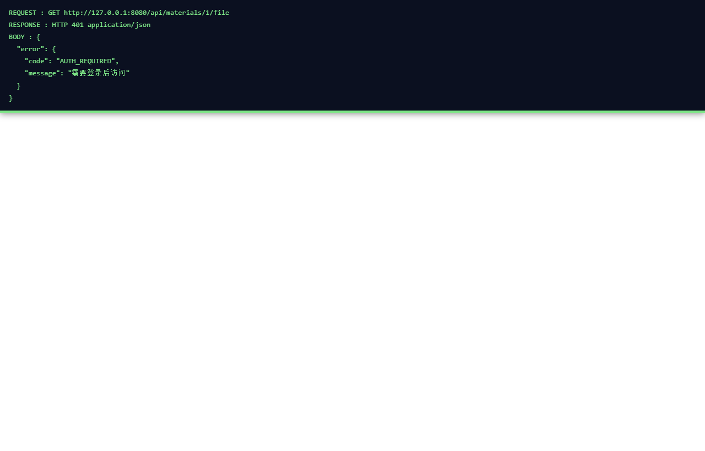
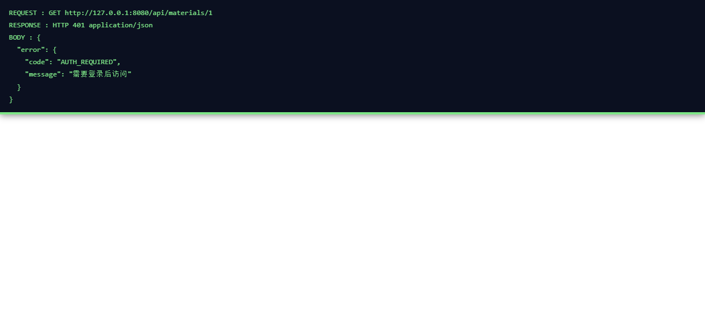
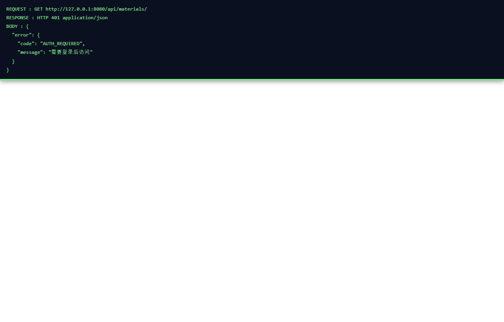
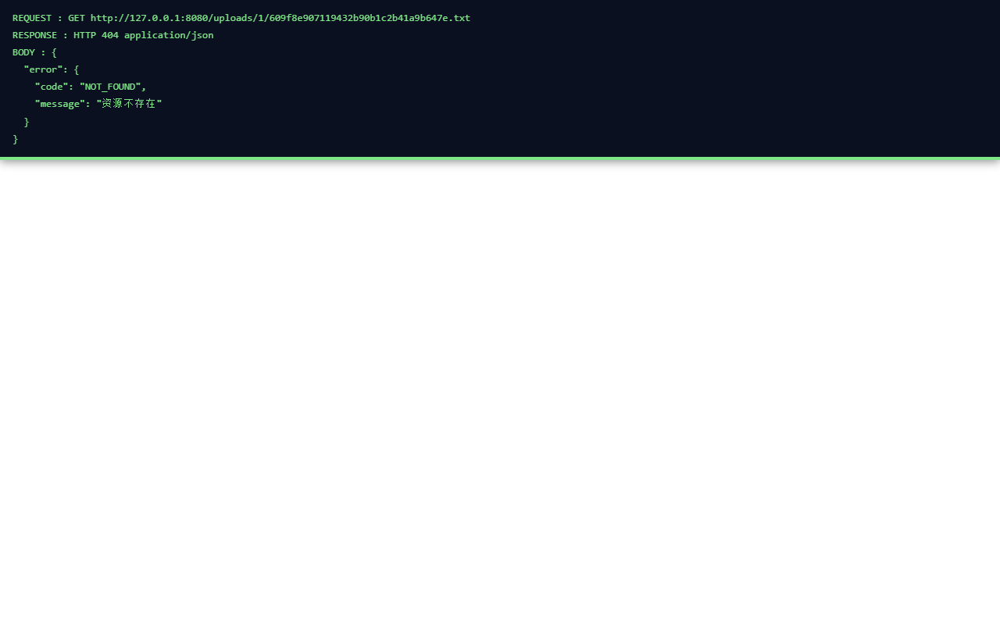
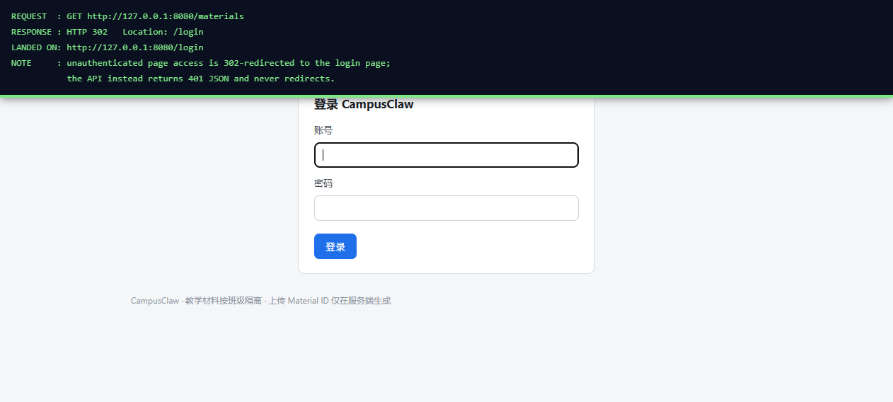
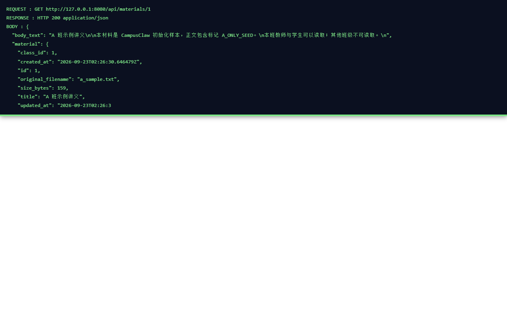
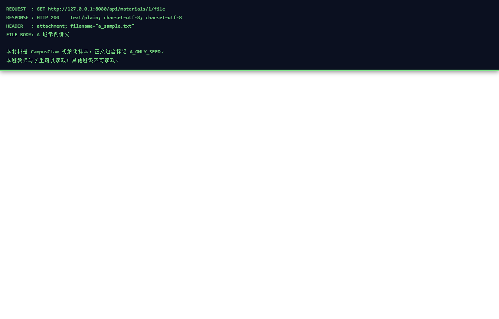

# 问题二：文件下载是否需要权限？实现逻辑？

> 适用代码版本：当前工作区 `campusClaw`（Flask + SQLite + 私有上传目录）。
> 结论均以源码为准，括号内为 `文件:行号`；文末附**未授权访问的实测截图**。

---

## 1. 结论

**需要权限。** 下载是**受保护接口**，不是公开静态文件：

- 必须持有**有效登录会话**（`require_api_auth`，`request_context.py:57-62`），否则返回 `401 AUTH_REQUIRED`
  （JSON，不会被重定向成 HTML 登录页）
- **强制班级隔离**：只能下本班材料；跨班 ID 与不存在的 ID 一样，统一 `404 MATERIAL_NOT_FOUND`
  —— 不暴露「存在但无权」的差异
- **上传目录不作为静态目录暴露**：应用 `static_folder=None`（`__init__.py:80`），且显式注册
  `/uploads/<key>`、`/static/uploads/<key>` 两个路由**直接 404**（`page_views.py:34-41`），
  防止靠猜路径绕过权限拿文件

---

## 2. 接口定义

```
GET /api/materials/<material_id>/file
```

实现（`material_views.py:58-74`）：

| 步骤 | 动作 | 说明 |
| --- | --- | --- |
| 1 | `require_api_auth()` | 会话校验：sid 摘要比对 + 已撤销检查 + 过期检查（`sessions.py:47-61`，会话 8 小时） |
| 2 | `reject_identity_fields()` | 拒绝 query 里出现 `class_id` 等身份字段 |
| 3 | **三重定位** | `WHERE id=? AND class_id=? AND status='active'`（`materials.py:54-61`） |
| 4 | `read_material_file()` | 实际读取 `uploads/<class_id>/<storage_key>`（`materials.py:332-336`） |
| 5 | 组装响应 | 设 `Content-Type` / `Content-Disposition` / `nosniff` |

第 3 步的关键点：

- `class_id` 来自**服务端会话**，不是客户端提交值
- `status='active'` 保证已删除材料立即不可下载

响应头：

```
Content-Type: text/plain; charset=utf-8
Content-Disposition: attachment; filename="<原文件名>"     ← 文件名经 _safe_download_name 清洗 \r\n"\/ 
X-Content-Type-Options: nosniff
```

---

## 3. 读全文 / 列表接口（同一权限模型）

```
GET /api/materials/<material_id>        → JSON，含 body_text
GET /api/materials/                     → JSON，本班材料列表
```

- 详情接口返回的 `material` 摘要**主动剔除 `storage_key`**（`material_views.py:51`），
  不把内部存储键暴露给前端
- 列表 / 详情同样要求登录，并做 `class_id` 过滤（`materials.py:42-51`）；
  过滤在 **SQL 层**完成，不是「取全集再前端隐藏」

---

## 4. 一个容易误会的点

页面上的「下载原文件」按钮**并不会触发浏览器下载**——它用的是 `fetch(...).then(r => r.text())`，
把文件内容渲染到页面 `<pre>` 里（`materials.html:83-87`）。
只有**直接在浏览器里访问该 URL**（或右键另存 / `curl -O`）才会真正按 `Content-Disposition` 触发下载。
所以「看到内容」和「下载到本地」是两个不同行为，**权限要求完全一致**。

---

## 5. 未授权访问实测验证（截图 + 原始响应）

> 实测方式：`python app.py` 启动（127.0.0.1:8080），先清空浏览器 Cookie 保证处于**未登录**状态，
> 再逐一访问下列地址。截图由真实 Chromium 抓取，顶部深色条为实测时注入的说明浮层，
> 显示**实际请求 URL、HTTP 状态码与响应体**。

### 5.0 原始 HTTP 响应汇总（不带任何会话 Cookie）

| 请求 | 状态码 | 响应体 / Location |
| --- | --- | --- |
| `GET /health` | `200` | `{"status":"ok"}`（唯一匿名接口） |
| `GET /api/materials/` | `401` | `{"error":{"code":"AUTH_REQUIRED","message":"需要登录后访问"}}` |
| `GET /api/materials/1` | `401` | `{"error":{"code":"AUTH_REQUIRED","message":"需要登录后访问"}}` |
| `GET /api/materials/1/file` | `401` | `{"error":{"code":"AUTH_REQUIRED","message":"需要登录后访问"}}` |
| `GET /uploads/1/609f8e907119432b90b1c2b41a9b647e.txt` | `404` | `{"error":{"code":"NOT_FOUND","message":"资源不存在"}}` |
| `GET /static/uploads/609f8e907119432b90b1c2b41a9b647e.txt` | `404` | `{"error":{"code":"NOT_FOUND","message":"资源不存在"}}` |
| `GET /materials`（页面） | `302` | `Location: /login` |

> 第 5 行用的是**数据库里真实的 `storage_key`**——即便攻击者拿到了准确的文件名，
> 静态路径依然返回 404，证明「文件不可通过路径直取」不是靠文件名保密实现的。

### 5.1 直接请求下载接口 → 401，拿不到文件

地址栏访问 `http://127.0.0.1:8080/api/materials/1/file`，**未登录**：



返回 `401`，响应体为 `{"error":{"code":"AUTH_REQUIRED","message":"需要登录后访问"}}`，
**没有返回任何文件内容，也没有触发下载**。

### 5.2 请求材料详情 → 401

地址栏访问 `http://127.0.0.1:8080/api/materials/1`，**未登录**：



### 5.3 请求材料列表 → 401

地址栏访问 `http://127.0.0.1:8080/api/materials/`，**未登录**：



### 5.4 直接猜上传文件路径 → 404（静态路由被显式关闭）

地址栏访问 `http://127.0.0.1:8080/uploads/1/anything.txt`，**未登录**：



即便有人绕过 API、按 `uploads/<班级>/<随机键>` 猜路径直取文件，也只会拿到 `404`。

### 5.5 受保护页面 → 302 跳转登录页（对比）

地址栏访问 `http://127.0.0.1:8080/materials`，**未登录**：会被重定向到 `/login`。
这一条与 API 的差异值得注意——**页面**未登录是 302 跳登录页，**API** 未登录则固定返回 401 JSON。



### 5.6 对照组：登录后同一接口正常放行（证明 401 确实由「未登录」导致）

用 `student_a1` / `StudentA1#2026` 登录后，再访问**与 5.2 完全相同**的地址 `GET /api/materials/1`：



对比 5.2 的 `401`，同一 URL 在登录后返回 `200` 且带出正文内容（含 `A_ONLY_SEED` 标记）——
说明之前的拒绝**只取决于会话是否存在**，而非接口不存在或路径写错。

同理，登录后访问下载接口 `GET /api/materials/1/file`：



返回 `200`、`Content-Type: text/plain; charset=utf-8`、
`Content-Disposition: attachment; filename="a_sample.txt"`，并给出文件真实内容。
这条与 5.1 的 `401` 构成完整对照：**同一个文件地址，无会话拿不到，有会话才拿得到。**

---

## 5.7 截图清单

| 文件 | 说明 |
| --- | --- |
| `screenshots/01-unauth-download-401.png` | 未登录请求下载接口 → 401 |
| `screenshots/02-unauth-detail-401.png` | 未登录请求材料详情 → 401 |
| `screenshots/03-unauth-list-401.png` | 未登录请求材料列表 → 401 |
| `screenshots/04-uploads-path-404.png` | 未登录用真实存储键猜路径 → 404 |
| `screenshots/05-page-redirect-login.png` | 未登录访问受保护页面 → 302 跳登录页 |
| `screenshots/06-after-login-detail-200.png` | 登录后请求材料详情 → 200（对照组） |
| `screenshots/07-after-login-download-200.png` | 登录后请求下载接口 → 200 + 附件头（对照组） |

---

## 6. 删除与清理（顺带说明）

删除是「先墓碑、后删文件」两阶段（`materials.py:263-329`）：先在同事务里把 `materials.status` 置 `deleted`、
删掉 `knowledge_entries`、登记一条 `file_cleanup_jobs`；提交后再删磁盘文件。
若磁盘删除失败（如权限不足），任务留 `pending`，由启动恢复或
`python scripts/cleanup_files.py --once` 重试。删除后接口**立刻**返回 `404`，不等文件删完。

---

## 7. 小结

| 访问方式 | 未登录结果 |
| --- | --- |
| `GET /api/materials/<id>/file` | `401 AUTH_REQUIRED`（JSON，不返回文件） |
| `GET /api/materials/<id>` | `401 AUTH_REQUIRED` |
| `GET /api/materials/` | `401 AUTH_REQUIRED` |
| `GET /uploads/<班级>/<key>` | `404`（静态路由被显式关闭） |
| `GET /materials`（页面） | `302` → `/login` |
| `GET /health` | `200`（唯一的匿名接口，只读探测，不涉及任何文件） |
